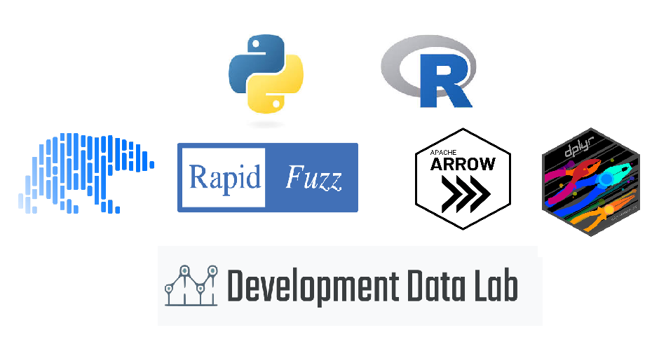

# R and Python FuzzyMatching | Analyzing, Corrupting, and Re-linking 50,000 Indian Court Cases

---
**Table of Contents**  
- [Motivations](#my-motivation-for-this-project)
- [Data Source](#data-source)
- [Pipeline Structure](#pipeline-overview) 
- [Corruption Design](#corruption-design)
- [Results](#results)
- [Limitations](#limitations-and-next-steps)
- [Reproducing](#reproducing-the-project)
- [Repo Structure](#repository-structure)
## My Motivation for this Project
Some of my particular interests is standardization of data to optimize performance when using large datasets, and dealing with extreme-scenarios of business or institution-wide database corruption.  
Furthermore, within the data analytics and general research field, R is an important language for statistical computing. 

Because my experience is limited to using Pandas and NumPy for manipulating loaded in memory datasets, I think having hands on experience FuzzyMatching using the Polars library and the R language was the best way I could learn more about these particular interests.

## Data source 
For this project I used the [DDL Judicial Data Portal](https://www.devdatalab.org/judicial-data) as my source. Following the instructions of the [user guide](https://github.com/devdatalab/paper-justice/wiki/User-guide---Judicial-bias-data), I extracted the dataset for 2018 case values, as well as the datasets which linked key columns to descriptive data. The data is legally available for my non-commercial use under the [CC BY-NC-SA 4.0 License](https://creativecommons.org/licenses/by-nc-sa/4.0/).

**Citation:**   @article{aabbcdgns2025bias,
	author = {Ash, Elliott and Asher, Sam and Bhowmick, Aditi and Bhupatiraju, Sandeep and Chen, Daniel and Devi, Tanaya and Goessmann, Christoph and Novosad, Paul and Siddiqi, Bilal},
	title = {In-Group Bias in the Indian Judiciary: Evidence from 5 Million Criminal Cases},
	journal = {The Review of Economics and Statistics},
	doi = {10.1162/rest_a_01569},
	url = {https://doi.org/10.1162/rest\_a\_01569},
	year = {2025},
}

## Pipeline Overview 
**--Reflections for individual sections within each notebook available directly in the .ipynb files--**

**Notebook 1: Exploring and Joining**   In notebook 1, I...
- Analyzed the dataset structures and individual data types
- Transformed data types to types more suited for corruption and fuzzy matching.
- Joined multiple descriptive key datasets to the main cases dataset
- Saved to the parquet file format   

**Notebook 2: Sampling and Corrupting**   In notebook 2, I...
- Sampled 50,000 cases from the total dataset to work with
- Built an answer key by adding a record id to each case and dropping every column but the internal DDL id and this record id
- Shuffled the cases and saved this as my clean dataset
- Dropped id columns and corrupted the shuffled dataset using typo insertions for chosen string columns and date changers for chosen date columns
- Saved this as my corrupted dataset, and put both clean and corrupted datasets in a folder visible to Github (/data_sampled)  

**Notebook 3 (Python): Linking**   In my third Python notebook, I...
- Standardized the columns within clean and corrupted to only what has been corrupted
- Calculated baseline precision and recall percentages (97.73% and 54.51%)
- Created blocks of cases under state name, judge_position, and case outcome for manageable memory use when linking
- Joined corrupted and clean tables on these blocks
- Created and implemented scoring system for column pairs, with a maximum of 1 per pair and total of 7 pairs - so best_match would have a score of 7
- Chose the highest value match for each record id
- Tested whether the corrupted ddl_case_id matches the clean case id for each record id
- Did this test for different score intervals, calculating precision and recall percentages for minumum scores of 5, 5.5, 6, 6.5, and 7.

**Notebook 3 (R): Linking**   In my only R notebook, I...
- Setup a renv enviornment, loaded arrow, dplyr, and fastlink
- Standardized the columns within clean and corrupted to only what has been corrupted
- Transformed date data into numeric values
- Ran fastLink on the state of Uttarakhand alone, comparing names by string similarity, dates numerically, and other fields by exact matching. This achieved 98.9 precision and 96.9 recall
- Looped over states, running fastLink on each, and combining the results
- Joined the proposed matches with my answer key, finding 95.9% precision and 92.2% recall

## Corruption Design
To test linking, I needed a corrupted copy where I knew the right answer for every record. I sampled 50,000 criminal cases, shuffled them, and gave each a new `record_id`, keeping the link between `record_id` and the true `ddl_case_id` in a separate answer key.

**What I corrupted:**
- **Filing dates:** shifted 15% of cases by 1–3 days, earlier or later
- **Decision dates:** shifted a separate, independent 15% of cases the same way
- **District and court names:** added one typo (a deleted, swapped, or replaced letter) to 10% of each
- **Case type and party genders:** blanked 5% of each

**What I left clean:** `state_name`, `judge_position`, and `disp_name_s` (case outcome), which I later used for blocking.

**What I dropped to prevent leakage:**
- ID columns (`ddl_case_id`, `cino`, judge IDs)
- Numeric code columns like `dist_code`, which would have let a matcher ignore my typos
- The three listing dates and judges' tenure dates, which almost identify a case on their own and wouldn't exist in a real second dataset
- All helper flag columns, which showed exactly which rows were corrupted

All randomness uses fixed seeds, so the corruption is identical on every run.

## Results
| Method | Precision | Recall |
|---|---|---|
| Exact matching | 97.7% | 54.5% |
| Python fuzzy matching (no threshold) | 97.1% | 97.1% |
| fastLink (R) | 95.9% | 92.2% |

## Limitations and next steps
- **Unused act and section lists:** I left these out of matching, even though a case's charges are fairly distinctive. Comparing their overlap would add evidence.
- **No one-to-one matching:** two records could choose the same clean case. fastLink also assigned about 669 clean cases to more than one record.
- **Skipped small states:** fastLink can't learn from very small blocks, so I skipped states with under 20 cases.
- **fastLink's date tolerance:** I used the default; setting it to 3 days would be a fairer comparison.
- **Hand-chosen scores:** my Python point values were my own choices, not estimated from the data.
- **Synthetic errors:** real records have different problems, like transliterated names and different ID formats.
- **Blocking on outcome:** this was only safe because I never corrupted it; a real High Court record wouldn't record a lower court's outcome the same way.

## Reproducing the Project
1. Clone the repository and install [uv](https://docs.astral.sh/uv/).
2. Run `uv sync` to install Python 3.14.4 and all packages.
3. In R, run `renv::restore()` to install the R packages.
4. To run notebooks 1 and 2, download the CSV versions of `cases.tar.gz`, `keys.tar.gz`, `judges_clean.tar.gz`, and `acts_sections.tar.gz` from the [DDL portal](https://www.devdatalab.org/judicial-data), and extract the 2018 files into `ddl_judicial_data/ddl_judicial_data_2018extracted/`.
5. Run the notebooks in order: `nb1`, `nb2`, then `nb3_python_linking`.
6. Run `nb3_r_linking.R` from the project root.

## Repository Structure
mini_r_project/     
├── data_sampled/ # 50,000-case samples (pushed to GitHub)    
│ ├── cases_sampled.parquet    
│ ├── corrupted_cases_labeled.parquet    
│ ├── cases_answer_key.parquet      
│ └── final_r.parquet     
├── notebooks/     
│ ├── nb1_exploring_and_joining.ipynb     
│ ├── nb2_sampling_and_corrupting.ipynb     
│ ├── nb3_python_linking.ipynb     
│ └── nb3_r_linking.R     
├── renv/, renv.lock, .Rprofile # R environment     
├── pyproject.toml, uv.lock, .python-version # Python environment     
├── Logo.png      
├── LICENSE    
└── README.md     

The full DDL data (`ddl_judicial_data/`) is gitignored because of its size.    
